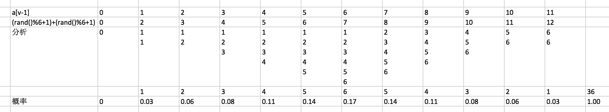

#一 回答问题
1.int 小整型占4个字节,可以表示32位 ;long long占8个字节,64位
2.注解主要是标注程序代码段含义与流程,方便阅读代码
3.试用某个函数需要把对应函数所在的库引入
4 指出下面语句执行完成后i,j,s的值

```
i=11
j=11
6
```
|i|s|
|---|---|
|0|1|
|1|1-2|                    
|2|1-2+3|                  
|3|1-2+3-4|                
|4|1-2+3-4+5|              
|5|1-2+3-4+5-6|            
|6|1-2+3-4+5-6+7|          
|7|1-2+3-4+5-6+7-8|        
|8|1-2+3-4+5-6+7-8+9|      
|9|1-2+3-4+5-6+7-8+9-10|   
|10|1-2+3-4+5-6+7-8+9-10+11|

#二 阅读分析程序并写出程序运行结果


```
 1:0.00
 2:0.03
 3:0.06
 4:0.08
 5:0.11
 6:0.14
 7:0.17
 8:0.14
 9:0.11
10:0.08
11:0.06
12:0.03
```

#三 回答问题和按要求写出函数定义
1.递归函数计算T(n)

```
int T(int n){
    if(n==0)return 0;
    else if(n<=2)return 1;
    else
        return T(n-1)+T(n-2)+T(n-3);
}
```
2.非递归函数计算T(n)

```
int T(int n){
    int i,t0=0,t1=1,t2=1,s=0;
    if(n==0)return 0;
    else if(n<=2)return 1;
    for(i=3;i<=n;i++){
        s=t0+t1+t2;
        t0=t1;
        t1=t2;
        t2=s;
    }
    return s;
}
```
3.比较1 和 2 定义的两个函数T(10)各自执行次数,哪个快一点

```
1.执行分析
0 1 2=>0
3=>T(2)+T(1)+T(0)+2=0+0+0+2=2
4=>T(3)+T(2)+T(1)+2=2+0+0+2=4
5=>T(4)+T(3)+T(2)+2=4+2+0+2=8
6=>T(5)+T(4)+T(3)+2=8+4+2+2=16
7=>T(6)+T(5)+T(4)+2=16+8+4+2=30
8=>30+16+8+2=56
9=>56+30+16+2=104
10=>104+56+30+2=192

2.执行分析
0 1 2=>0
3=>2
4=>2*2=4
5=>2*3=6
.
.
.
10=>2*8=16
第二种执行速度快
```

4.你比较n大的时候各自有什么问题

```
当n比较大
第一种会栈溢出
第二种安全
```

#四 用c实现split函数

#六

#七
```
typedef struct Node{
	Node *p,
	Node *n,
	int d
} Node;

void del(Node *head,int y){
	Node *tmp,t1,t2;
	tmp = head;
	while(tmp !=head){
		if(tmp->d==y){
			t1 = tmp->n;
			tmp->p->next=tmp->n;
			free(tmp);
			tmp=t1;
		}
	}
}
```

#八
```
>
<j
k++
k
k
```


#九 排序
```
快速排序
(0-4)5 8 12 7 10
(0-4)5 8 7 10 12
(0-2)5 8 7 10 12
(1-2)5 7 8 10 12
(3-4)5 7 8 10 12


```